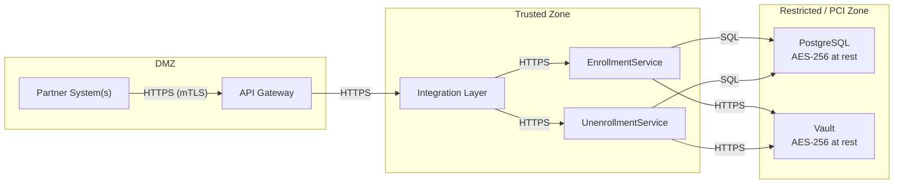
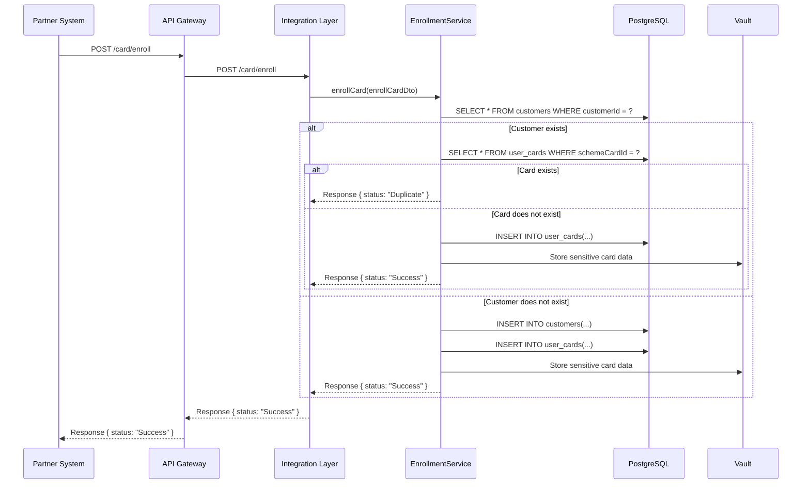
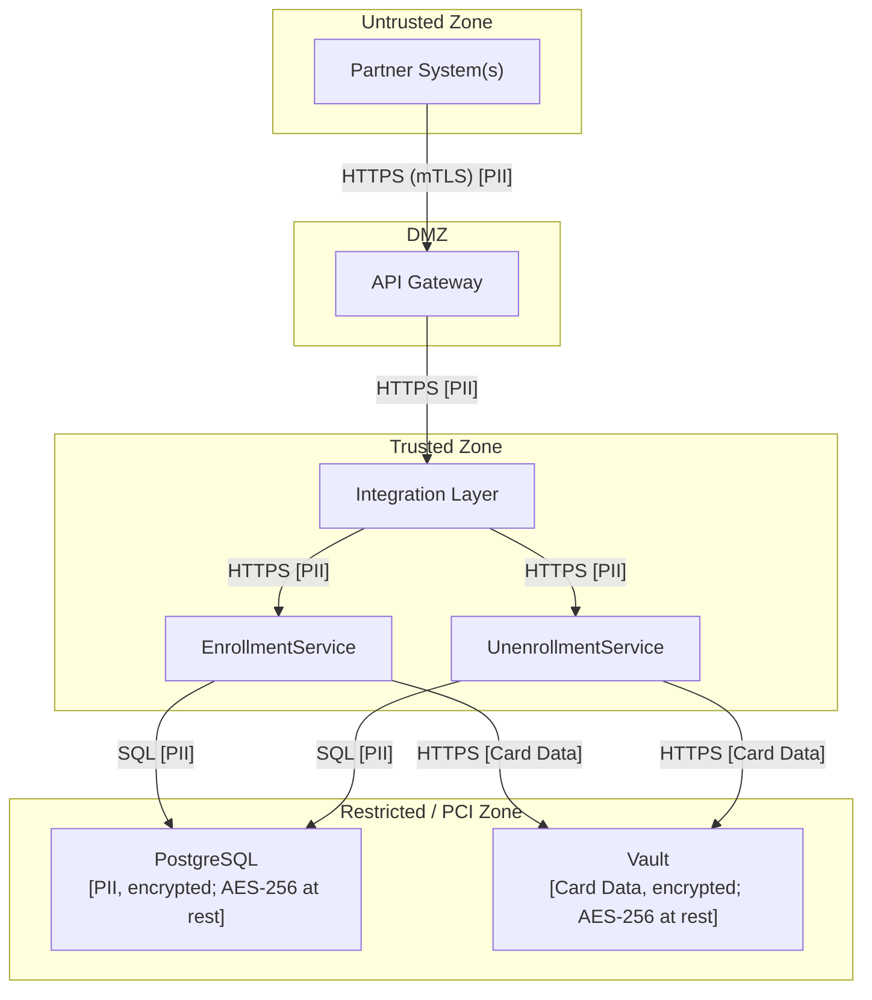

```markdown
## High-Level Architecture Diagram

```mermaid
flowchart LR
    subgraph dmz ["DMZ"]
        partner["Partner System(s)"]
        apiGw["API Gateway"]
    end

    subgraph trustedZone ["Trusted Zone"]
        integrationLayer["Integration Layer"]
        enrollmentSvc["EnrollmentService"]
        unenrollmentSvc["UnenrollmentService"]
    end

    subgraph restrictedZone ["Restricted / PCI Zone"]
        postgres["PostgreSQL<br/>AES-256 at rest"]
        vault["Vault<br/>AES-256 at rest"]
    end

    partner -- "HTTPS (mTLS)" --> apiGw
    apiGw -- "HTTPS" --> integrationLayer
    integrationLayer -- "HTTPS" --> enrollmentSvc
    integrationLayer -- "HTTPS" --> unenrollmentSvc
    enrollmentSvc -- "SQL" --> postgres
    unenrollmentSvc -- "SQL" --> postgres
    enrollmentSvc -- "HTTPS" --> vault
    unenrollmentSvc -- "HTTPS" --> vault
```

## Sequence Diagrams
### Enrollment / Onboarding

```mermaid
sequenceDiagram
    participant partner as Partner System
    participant apiGw as API Gateway
    participant integrationLayer as Integration Layer
    participant enrollmentSvc as EnrollmentService
    participant postgres as PostgreSQL
    participant vault as Vault

    partner ->> apiGw: POST /card/enroll
    apiGw ->> integrationLayer: POST /card/enroll
    integrationLayer ->> enrollmentSvc: enrollCard(enrollCardDto)
    enrollmentSvc ->> postgres: SELECT * FROM customers WHERE customerId = ?
    alt Customer exists
        enrollmentSvc ->> postgres: SELECT * FROM user_cards WHERE schemeCardId = ?
        alt Card exists
            enrollmentSvc -->> integrationLayer: Response { status: "Duplicate" }
        else Card does not exist
            enrollmentSvc ->> postgres: INSERT INTO user_cards(...)
            enrollmentSvc ->> vault: Store sensitive card data
            enrollmentSvc -->> integrationLayer: Response { status: "Success" }
        end
    else Customer does not exist
        enrollmentSvc ->> postgres: INSERT INTO customers(...)
        enrollmentSvc ->> postgres: INSERT INTO user_cards(...)
        enrollmentSvc ->> vault: Store sensitive card data
        enrollmentSvc -->> integrationLayer: Response { status: "Success" }
    end
    integrationLayer -->> apiGw: Response { status: "Success" }
    apiGw -->> partner: Response { status: "Success" }
```

## Data Flow Diagram (DFD)

```mermaid
flowchart TD
    subgraph untrusted ["Untrusted Zone"]
        partner["Partner System(s)"]
    end

    subgraph dmz ["DMZ"]
        apiGw["API Gateway"]
    end

    subgraph trustedZone ["Trusted Zone"]
        integrationLayer["Integration Layer"]
        enrollmentSvc["EnrollmentService"]
        unenrollmentSvc["UnenrollmentService"]
    end

    subgraph restrictedZone ["Restricted / PCI Zone"]
        postgres["PostgreSQL<br/>[PII, encrypted; AES-256 at rest]"]
        vault["Vault<br/>[Card Data, encrypted; AES-256 at rest]"]
    end

    partner -- "HTTPS (mTLS) [PII]" --> apiGw
    apiGw -- "HTTPS [PII]" --> integrationLayer
    integrationLayer -- "HTTPS [PII]" --> enrollmentSvc
    integrationLayer -- "HTTPS [PII]" --> unenrollmentSvc
    enrollmentSvc -- "SQL [PII]" --> postgres
    unenrollmentSvc -- "SQL [PII]" --> postgres
    enrollmentSvc -- "HTTPS [Card Data]" --> vault
    unenrollmentSvc -- "HTTPS [Card Data]" --> vault
```